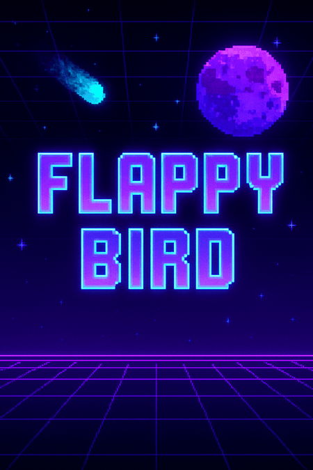
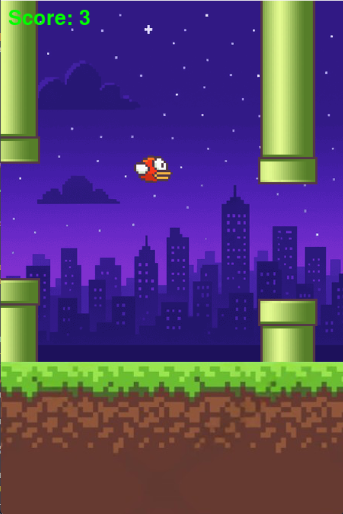

# FlappyBirdClone
# FlappyBirdClone 🐦🎮

A retro arcade-style Flappy Bird clone built with Python and Pygame.

## Features
- Pixelated arcade theme 🎆
- Score tracking and sound effects 🔊
- Restart and Game Over screens 💀

## How to Play
- Press **SPACE** to flap
- Avoid the pipes and get the highest score possible!

## Installation
```bash
git clone https://github.com/Vedansh186/FlappyBirdClone.git
cd FlappyBirdClone
pip install pygame
python main.py
```
## **Screenshots**
Here are some screenshots from the game

### Home Screen


### Gameplay


### Game Over

